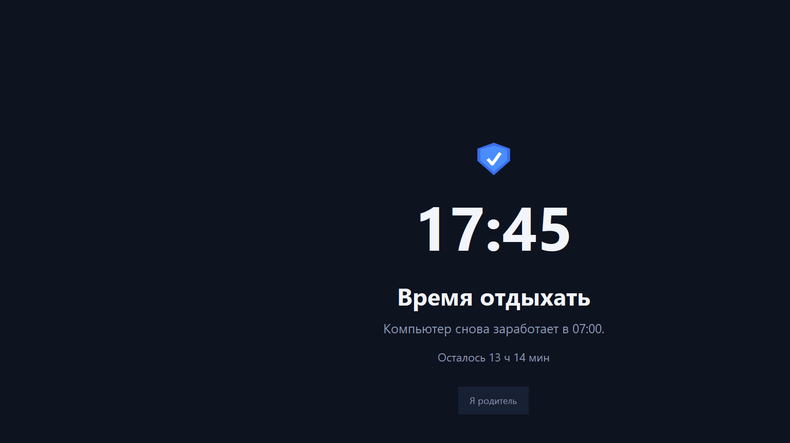
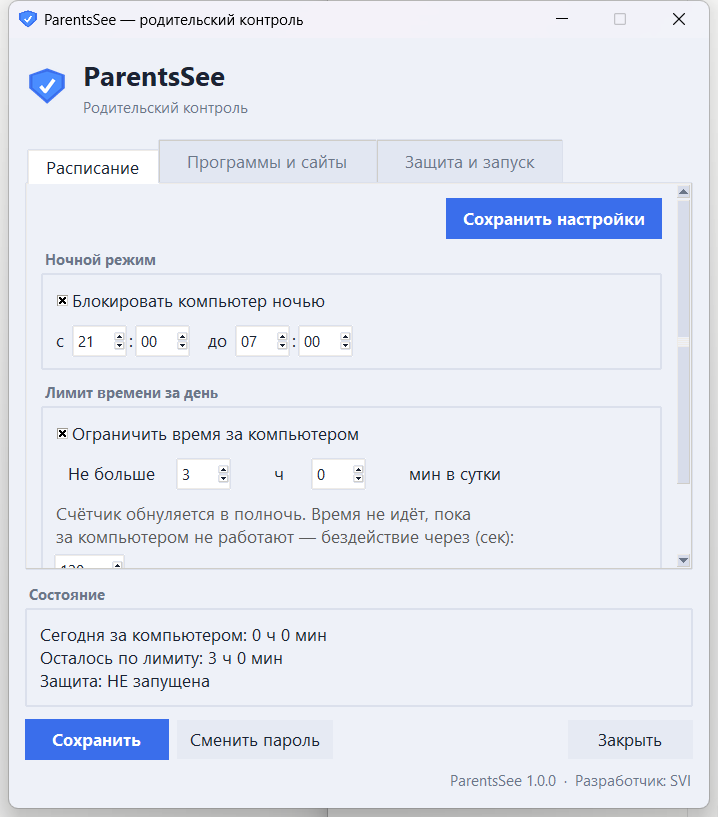
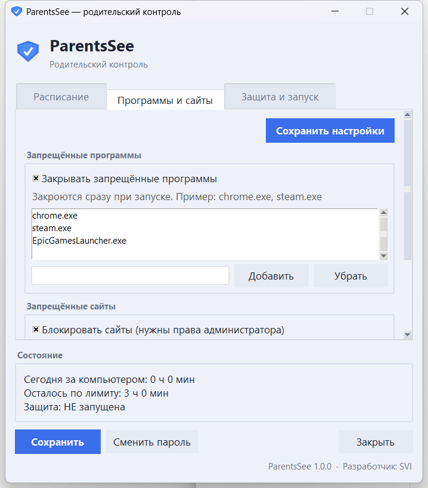
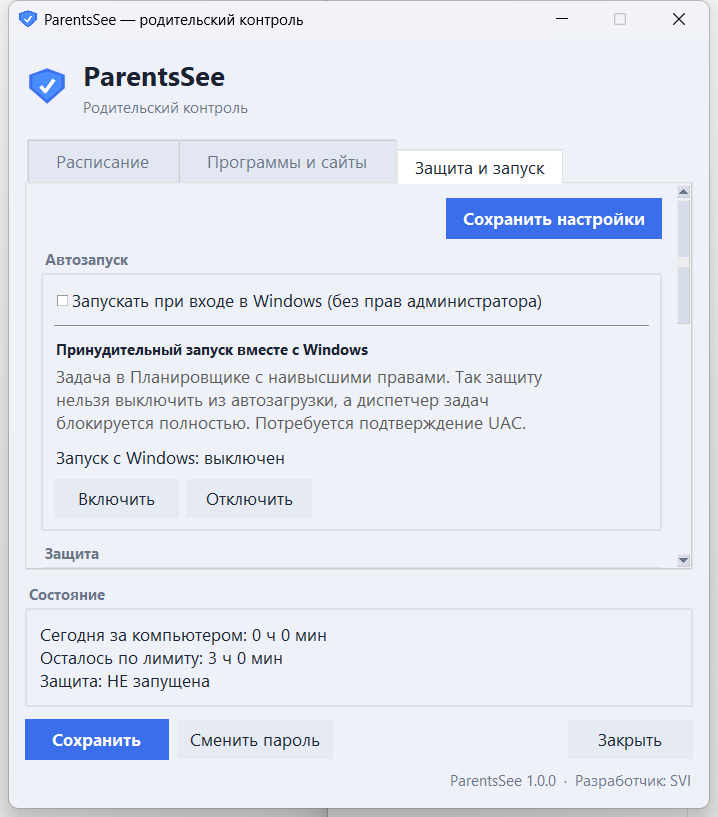

<div align="center">


# ParentsSee

**Родительский контроль для Windows** — расписание, лимит времени, блокировка
программ и сайтов, экран блокировки со снятием по паролю. Работает фоном со
значком в системном трее.


Разработчик: **SVI**

<br>

[](https://github.com/PatriarchKirill/ParentsSee/releases/latest/download/ParentsSee.exe)

<sub>Скачается только один файл · Python не нужен</sub>

</div>

---

## 📸 Как это выглядит

<div align="center">



<em>Экран блокировки — на весь экран, снимается только паролем родителя.</em>

<br><br>






</div>

---

## ✨ Возможности

**Расписание и время**
- Ночной режим (например, с 21:00 до 07:00, с учётом перехода через полночь).
- Дневной лимит времени, счётчик обнуляется в полночь.
- Время идёт, только пока за компьютером реально работают.
- Предупреждения за 15, 5 и 1 минуту до блокировки.

**Блокировка программ и сайтов**
- Запрещённые программы закрываются сразу при запуске.
- Запрещённые сайты блокируются через файл `hosts` (нужны права администратора).

**Экран блокировки**
- На весь экран и на всех мониторах, поверх всего, с часами и обратным отсчётом.
- Скрывается панель задач; не работают Win, Alt+Tab, Alt+F4, Ctrl+Esc,
  Ctrl+Shift+Esc.
- Снятие только по паролю родителя (на 15/30/60/120 минут) или открытие настроек.
- Кнопка «Отменить разрешённое время» — вернуть блокировку досрочно.

**Значок в трее**
- При наведении показывает, сколько осталось до блокировки.
- Правый клик: открыть настройки, заблокировать сейчас, остановить защиту.

**Запуск и устойчивость**
- Пароль на вход в программу.
- Автозапуск при входе в Windows; принудительный запуск через Планировщик задач
  с наивысшими правами (UAC).
- Учёт времени и блокировка сохраняются после перезагрузки.
- Файл учёта подписан HMAC — правка или удаление обнаруживаются.

**Обновления**
- Встроенная проверка обновлений: свой JSON-манифест или **GitHub Releases**.

---

## 🚀 Установка

### Готовый `.exe` (проще всего, Python не нужен)

1. Скачайте один файл —
   **[ParentsSee.exe (последняя версия)](https://github.com/PatriarchKirill/ParentsSee/releases/latest/download/ParentsSee.exe)**.
   Скачивается только `.exe`, без исходников. Все версии — на странице
   [Releases](https://github.com/PatriarchKirill/ParentsSee/releases).
2. Положите файл в постоянную папку и запустите двойным кликом.
3. При первом запуске придумайте пароль родителя.

> При первом запуске Windows SmartScreen может предупредить о неизвестном
> издателе (`.exe` не подписан сертификатом) — нажмите «Подробнее → Выполнить
> в любом случае». Антивирус может попросить добавить в исключения: перехват
> клавиатуры и правка `hosts` для него выглядят подозрительно.

### Из исходников

Нужен **Python 3.11+**. Установите зависимости и запустите:

```bash
pip install -r requirements.txt
python -m parentssee
```

Или запустите `Установить ParentsSee.bat` — он сам проверит и при необходимости
установит Python (через winget) и библиотеки, затем запустит программу.

---

## 📖 Как пользоваться

1. Запустите программу и задайте **пароль родителя** (его должен знать только
   взрослый).
2. На вкладке **«Расписание»** включите ночной режим и/или дневной лимит,
   нажмите **«Сохранить настройки»**.
3. На вкладке **«Программы и сайты»** добавьте то, что нужно заблокировать.
4. На вкладке **«Защита и запуск»** включите автозапуск, чтобы защита
   возвращалась после перезагрузки.
5. Закройте окно — защита продолжит работать в трее (значок рядом с часами).

---

## 🔄 Обновления

На вкладке **«Защита и запуск»** есть раздел «Обновления». Впишите адрес
манифеста и нажмите «Проверить обновления» — собранный `.exe` скачает новую
версию, проверит контрольную сумму и заменит себя, затем перезапустится.

### Через GitHub Releases (ничего хостить не нужно)

1. Создайте в репозитории **Release** с тегом-версией (например `v1.1.0`).
2. Прикрепите к релизу файл `ParentsSee.exe` (Assets).
3. В поле «Адрес обновлений» впишите:
   ```
   https://api.github.com/repos/PatriarchKirill/ParentsSee/releases/latest
   ```

Программа возьмёт версию из тега, ссылку на `.exe` из вложений и описание из
текста релиза. Чтобы выпустить обновление — просто опубликуйте новый Release.

### Свой манифест

Разместите на своём хостинге JSON:

```json
{
  "version": "1.1.0",
  "url": "https://ваш-сайт/ParentsSee.exe",
  "sha256": "контрольная-сумма-нового-exe",
  "notes": "Что нового в этой версии"
}
```

---

## ⌨️ Про Ctrl+Alt+Del честно

Саму комбинацию Ctrl+Alt+Del **не может перехватить ни одна обычная программа** —
её обрабатывает ядро Windows (это защита самой ОС от вредоносов). Но с её экрана
можно убрать всё опасное: кнопка «Усилить Ctrl+Alt+Del» (через UAC) отключает
диспетчер задач, «Сменить пользователя», «Выйти», «Заблокировать», «Сменить
пароль». Тогда экран становится бесполезным.

Максимальная защита — когда ребёнок работает под **обычной учётной записью**
Windows (без прав администратора), а ParentsSee запущен через Планировщик с
наивысшими правами: процесс нельзя снять, диспетчер задач отключён, а системное
время (сдвигом которого можно было бы обнулить счётчик) менять нельзя.

---

## 🛠️ Сборка `.exe`

Запустите **`Собрать EXE.bat`** (установит PyInstaller и соберёт один файл),
готовый файл появится в `dist\ParentsSee.exe`. Вручную:

```bash
pip install pyinstaller pystray Pillow
pyinstaller --noconfirm --onefile --windowed --name ParentsSee ^
  --icon assets/icon.ico --collect-submodules pystray ^
  --hidden-import PIL._tkinter_finder --version-file version_info.txt ParentsSee.pyw
```

### Автоматический релиз (GitHub Actions)

В репозитории настроен workflow [`.github/workflows/build.yml`](.github/workflows/build.yml).
Чтобы выпустить новую версию, достаточно опубликовать тег:

```bash
git tag v1.1.0
git push origin v1.1.0
```

GitHub сам соберёт `ParentsSee.exe` на `windows-latest` и приложит его к новому
Release — после чего встроенные обновления подхватят его автоматически.

---

## 📂 Где лежат данные

`C:\ProgramData\ParentsSee\` — настройки (`config.json`), счётчик времени
(`state.json`, подписан от подделки) и журнал (`parentssee.log`).

---

## 🗂️ Структура проекта

```
parentssee/        исходный код (агент, экран блокировки, настройки, блокировщик)
assets/            иконки
docs/screenshots/  скриншоты для README
ParentsSee.pyw     точка входа
*.bat              установка из исходников и сборка .exe
```

---

## 📜 Лицензия

[MIT](LICENSE) © 2026 SVI
